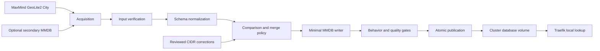

# stategeodb

`stategeodb` is an offline compiler for producing small, deterministic MaxMind
DB (MMDB) artifacts containing only the country and first-level subdivision
data required by `traefik-plugin-state-geo`.

The project keeps geolocation acquisition, comparison, normalization,
correction, and publication outside Traefik's request path. Traefik continues
to perform local in-process MMDB lookups and never depends on a remote API,
SQL database, document database, or a specific CDN.

> [!IMPORTANT]
> The CLI currently exposes the planned domain commands for help and automation
> discovery, but their domain operations are not implemented yet.

## Current CLI foundation

The implemented root command accepts these forms:

```text
stategeodb
stategeodb --help
stategeodb -h
stategeodb help
stategeodb --version
```

Root help lists `build`, `compare`, `verify`, `inspect`, and `publish` in that
order. Each command supports `stategeodb help <command>`,
`stategeodb <command> --help`, and `stategeodb <command> -h`.

Help and version results are written to stdout. Invoking a recognized domain
command returns exit code `1` with a fixed unavailable diagnostic on stderr.
Invalid flags, arguments, command names, and output failures also return exit
code `1`. The current CLI therefore uses `0` for success and `1` for failure;
stderr diagnostics, rather than process-status subcategories, distinguish
failure causes. This binary model may be revised after real automation
requirements exist. Domain operations, configuration, JSON output, MMDB
processing, and publication are not implemented in the current build.

The internal source-neutral normalization layer now validates canonical IPv4,
IPv6, and mapped-IPv4 prefixes, country and first-subdivision codes, and stable
logical source IDs. The MaxMind adapter pins
`github.com/oschwald/maxminddb-golang/v2` at `v2.4.1` and can open a local
`GeoLite2-City` or `GeoIP2-City` MMDB, validate its metadata, run the upstream
full structural verifier, and expose an application-owned metadata snapshot.
It does not traverse networks or decode records, and it is not wired to any CLI
command. Source acquisition remains external.

The adapter uses the direct ISC-licensed MMDB reader because the compiler needs
metadata and full verification now and direct network iteration in the next
phase without adopting the high-level GeoIP result model. Its current metadata
compatibility is deliberately strict: database types must match exactly and
the binary format must be `2.0`. The minor-version restriction follows the
pinned verifier and must be revisited if that verifier adds newer format
support. IPv4-only City databases remain compatible.

## Development

Development requires Go 1.26 or newer within the Go 1 compatibility promise.
On macOS and Linux systems with Make available, run the complete local
foundation validation with:

```text
make check
```

`make build` writes the executable to `bin/stategeodb`. The `bin/` directory is
ignored by Git. The Makefile is a POSIX-oriented convenience; developers
without Make can run the authoritative commands directly:

```text
find . -type f -name '*.go' -exec gofmt -l {} +
go mod tidy -diff
go list -m all
go test -count=1 ./...
go test -race -count=1 ./...
go vet ./...
if [ -L bin ] || [ -L bin/stategeodb ]; then
  printf '%s\n' 'refusing to build through a symlink' >&2
  false
else
  mkdir -p bin
  go build -o bin/stategeodb ./cmd/stategeodb
fi
```

The current CLI keeps help, version, invalid-usage, and unavailable-command
output text-only. Concrete configuration remains deferred until source
ingestion is wired to an operation; JSON schemas begin with structured report
or inspection results; and operation-level cancellation tests begin with the
first application-controlled blocking loop. All five domain operations remain
unavailable in this build.

## Why this exists

City databases contain substantially more information than the middleware
needs. Loading those complete files in every Traefik process duplicates unused
city names, coordinates, postal data, localized names, and other fields across
the cluster.

`stategeodb` will compile source databases into a minimal schema:

```text
country.iso_code
subdivisions[0].iso_code
```

It will also provide an auditable place to:

- compare independent geolocation sources without changing production policy;
- fill missing data using an explicit, conservative merge policy;
- apply reviewed CIDR location corrections;
- validate database structure, freshness, and behavioral changes;
- publish a new database atomically while retaining the last known-good file.

## Design goals

- Keep all request-time geolocation local to the Traefik process.
- Produce reproducible output from identical inputs and configuration.
- Treat IPv4 and IPv6 as equal, first-class inputs.
- Separate memory optimization from accuracy experiments.
- Preserve primary-source values unless a configured policy says otherwise.
- Fail before publication when an input, override, or output is invalid.
- Produce machine-readable reports suitable for a Kubernetes CronJob.
- Keep source credentials and licensed data out of generated logs and Git.

## Non-goals

- Running a geolocation HTTP, gRPC, SQL, MongoDB, or Redis service.
- Performing network lookups from the Traefik middleware.
- Replacing provider licenses or determining geographic truth by voting alone.
- Embedding access-control policy into geographic source data.
- Deploying directly to a live cluster from the CLI.
- Shipping source or generated production databases in this repository.

## Planned pipeline



See [Architecture](docs/ARCHITECTURE.md) for component boundaries, data flow,
merge rules, failure behavior, and Kubernetes integration.

## Planned command surface

```text
stategeodb build     Compile normalized sources and overrides into an MMDB
stategeodb compare   Report coverage and disagreement without publishing
stategeodb verify    Validate source or generated artifacts and quality gates
stategeodb inspect   Print metadata and selected lookups for diagnostics
stategeodb publish   Publish an already built and verified candidate artifact
```

`build` will create and verify a candidate artifact but will never replace the
stable published artifact. `publish` is the only command that will perform
publication. `compare` will not merge or publish, `inspect` will remain bounded
to metadata and explicitly selected lookups, and `publish` will not compile
sources.

All commands will follow normal Unix automation conventions:

- structured output is written to stdout;
- diagnostics are written to stderr;
- non-zero exit codes identify usage, input, validation, or publication errors;
- commands accept cancellation and avoid partial output publication;
- human-readable and JSON output are explicitly selectable.

## Initial source policy

The first production compiler will use GeoLite2 City as the sole authoritative
source. A second source may initially be used only for comparison.

When fallback merging is later enabled, the default policy will be:

1. Keep a non-empty primary country.
2. Fill a missing primary country from the secondary source.
3. Keep a non-empty primary subdivision.
4. Fill a missing primary subdivision only when both sources agree on country.
5. Keep the primary value on conflicts and report the disagreement.
6. Apply reviewed CIDR location corrections after source merging.

This policy improves missing coverage without silently replacing known primary
values. More aggressive consensus policies require separate evidence and are
outside the initial release.

## Scheduled operation

The intended Kubernetes pattern is one builder CronJob per cluster:

1. The official MaxMind updater downloads or checks the current source.
2. Optional source adapters acquire their databases.
3. `stategeodb build` verifies inputs and compiles a candidate in temporary
   storage.
4. The candidate is reopened, structurally verified, and compared with the
   current artifact.
5. The build emits a checksum, provenance manifest, and comparison report.
6. A separate `stategeodb publish` invocation replaces the stable MMDB path
   using an atomic same-filesystem rename.
7. Traefik detects the new file and swaps to the validated reader.

Individual Traefik pods must not independently download or compile databases.
The scheduler publishes one reviewed generation for all consumers of the
cluster volume.

## Data and licensing

This repository contains code, documentation, and a small reviewed set of
upstream test fixtures. Production source and generated MMDB files are ignored
by Git.

Operators are responsible for satisfying the terms of every configured data
source, including attribution, update, internal-use, and redistribution
requirements. Transforming or combining datasets does not remove those
obligations.

Relevant upstream projects and terms include:

- [MaxMind GeoLite databases](https://dev.maxmind.com/geoip/geolite2-free-geolocation-data/)
- [MaxMind GeoIP Update](https://dev.maxmind.com/geoip/updating-databases/)
- [MaxMind MMDB writer](https://github.com/maxmind/mmdbwriter)
- [maxminddb-golang reader](https://github.com/oschwald/maxminddb-golang)
- [DB-IP Lite databases](https://db-ip.com/db/lite.php)

Generated database artifacts must not be published or committed unless their
complete source-license obligations have been reviewed.

## Repository documentation

- [Architecture](docs/ARCHITECTURE.md): committed technical design and durable
  decisions.
- `AGENTS.md`: committed development and verification conventions.
- `docs/PHASES.md`: local implementation plan; intentionally ignored.
- `docs/phases/`: local phase execution prompts; intentionally ignored.

The private phase files are kept outside Git so implementation planning can be
iterated without publishing operational research in the public repository.
