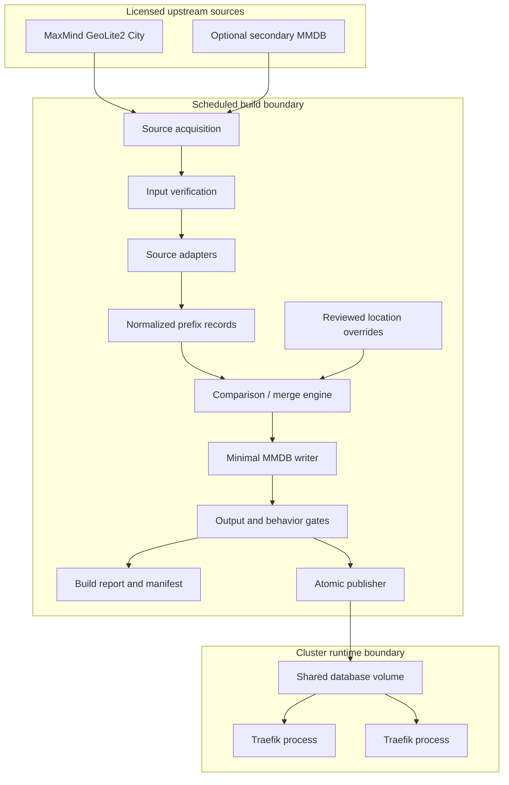
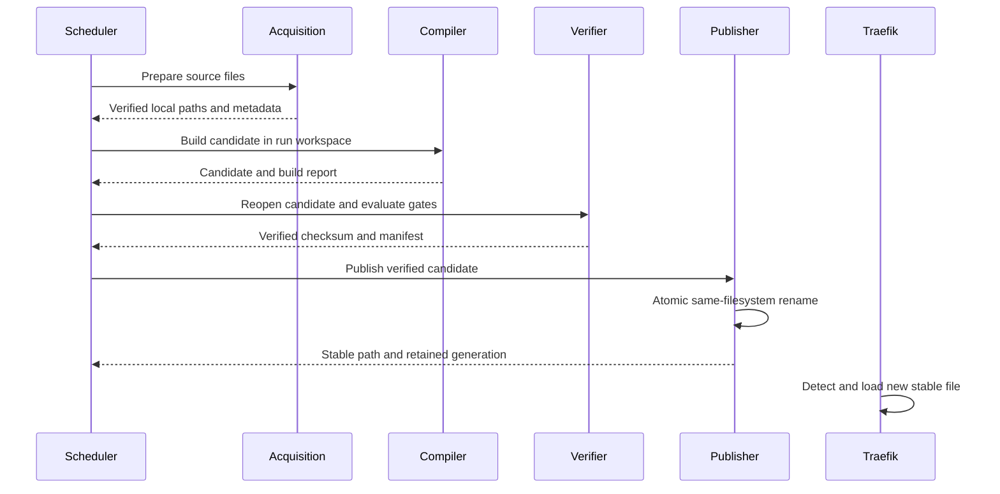

# Architecture

## 1. Purpose

`stategeodb` is an offline compiler and validation tool for creating a minimal
MMDB artifact for `traefik-plugin-state-geo`.

The compiler moves data acquisition, normalization, comparison, correction,
and publication out of Traefik's request path. Traefik remains responsible only
for resolving the client address, reading a local immutable database, applying
middleware policy, and serving the resulting allow or deny decision.

This document records durable architecture. Detailed implementation sequencing
and agent prompts live in ignored local planning files.

## 2. Context and drivers

The middleware needs only a two-character country code and, for United States
policy, a first-level subdivision code. A complete City database carries many
fields that are unused but loaded into each Traefik process.

The design is driven by five concerns:

1. **Cluster memory:** every Traefik process needs its own in-process reader, so
   unused database fields are multiplied by replica count.
2. **Request availability:** geolocation enforcement must not depend on a remote
   database, API, CDN, or cluster service.
3. **Accuracy:** free providers can be incomplete or wrong, and agreement
   between providers is not ground truth.
4. **Operational safety:** an incomplete or unexpectedly changed database must
   never replace the last known-good artifact.
5. **Licensing:** every source retains its own attribution, internal-use, update,
   and redistribution obligations after transformation.

## 3. Architectural principles

- Compile offline; look up locally.
- Keep the runtime artifact small and immutable.
- Separate source comparison from production merging.
- Separate location facts from access-control decisions.
- Make precedence and conflict handling explicit.
- Treat IPv4 and IPv6 as equal throughout the pipeline.
- Make identical builds reproducible.
- Publish only after structural and behavioral verification.
- Preserve one stable path for Traefik and one last known-good generation.
- Prefer reports and measurable gates over inferred accuracy claims.

## 4. System context



The scheduled build is the only component that communicates with upstream data
providers. Runtime lookup stays local even when the scheduler, provider, or
network is unavailable.

## 5. Deployment boundaries

### 5.1 CLI repository

This repository owns:

- source adapters and normalized data types;
- comparison and merge behavior;
- location override validation and application;
- MMDB writing and verification;
- build reports, manifests, and atomic publication primitives;
- a container image for scheduled execution;
- reference configuration and deployment examples.

### 5.2 Traefik plugin repository

The plugin repository owns:

- client IP resolution and trusted proxy rules;
- local database lifecycle and hot reload;
- request-time caching and failure policy;
- state and country policy decisions;
- block response behavior.

The compiler must not import the plugin package. Compatibility is defined by a
small MMDB schema and integration fixtures.

### 5.3 Cluster repositories

Cluster repositories own:

- CronJob schedules and image pinning;
- Secrets and provider account configuration;
- PVC topology and access modes;
- resource requests and limits;
- alerting and operational rollout;
- live deployment and rollback.

The CLI does not directly apply Kubernetes resources.

## 6. Planned command model

The initial command tree is:

```text
stategeodb build
stategeodb compare
stategeodb verify
stategeodb inspect
stategeodb publish
```

### `build`

Loads configured local inputs, applies the selected merge policy and location
overrides, writes a candidate minimal MMDB, and validates it. It never publishes
the candidate or replaces the stable artifact.

### `compare`

Traverses one or more sources and reports coverage, missing values, conflicts,
and changes. It does not write a production MMDB or change publication state.

### `verify`

Validates an input or generated MMDB, configuration, override file, provenance
manifest, checksum, and configured behavioral gates.

### `inspect`

Prints database metadata and explicitly requested prefix or address records for
operator diagnostics. It must not enumerate or expose full licensed datasets by
default.

### `publish`

Publishes an already built and verified candidate through the explicit
publication boundary. It does not acquire inputs, compile sources, change
records, or perform an implicit build. `publish` is the only command that may
replace the stable artifact.

The Phase 0 command shell exposes all five commands and their help. Their domain
operations remain explicitly unavailable until their implementation phases.
The current shell uses process status `0` for success and `1` for every failure;
stderr diagnostics distinguish invalid usage, unavailable commands, and output
failures. This binary status model is a foundation-stage contract, not a promise
about the taxonomy needed after real automation behavior is implemented.

## 7. Internal component boundaries

The package names below describe responsibilities rather than a frozen layout.

### Configuration

This planned boundary will parse and validate file, environment, and flag inputs
into one immutable runtime configuration. Concrete parsing begins only when
Phase 1 defines real source-ingestion fields; the foundation intentionally has
no empty configuration type, precedence machinery, or format dependency.
Configuration validation must complete before source acquisition or output
creation once implemented.

### Source acquisition

Makes an input database available locally. MaxMind binary acquisition should
normally be delegated to the official `geoipupdate` program or container.
Adapters for other sources may perform bounded downloads when their license and
distribution mechanism permit it.

Acquisition and compilation remain separate interfaces so builds can run from
already downloaded files in tests and controlled environments.

### Source adapter

Opens and verifies one MMDB, reads its metadata, iterates networks, and maps its
provider-specific schema into normalized records.

```go
type SourceRecord struct {
    Prefix      netip.Prefix
    Country     string
    Subdivision string
    SourceID    string
}
```

The implemented source-neutral record is an ordinary copyable Go value. Its
source ID is a non-empty logical identifier such as `primary` or
`maxmind-city`, never an inferred filesystem path. Source IDs preserve case and
use an ASCII token: they begin and end with a letter or digit and may contain
letters, digits, hyphens, underscores, or periods. Paths, URLs, Unicode,
whitespace, and control characters are invalid.

An empty country and subdivision represent a known source network whose
required location is unknown. A subdivision without a country is invalid. The
record contains geographic facts only and must not carry middleware allow/deny
policy, credentials, authenticated URLs, filesystem paths, or complete provider
metadata.

### Normalizer

Canonicalizes addresses and ISO-style codes:

- rejects invalid prefixes and masks native IPv4 and IPv6 prefixes;
- converts an IPv4-mapped IPv6 prefix contained by `::ffff:0:0/96` to native
  IPv4, subtracting 96 from its prefix length;
- rejects shorter mapped prefixes that also describe non-mapped IPv6 space;
- accepts an empty country as unknown, otherwise requiring exactly two ASCII
  letters and normalizing lowercase to uppercase;
- accepts an empty first subdivision as unknown, otherwise requiring one to
  three ASCII letters or digits and normalizing lowercase to uppercase;
- represents absent values explicitly;
- does not maintain country or subdivision membership tables.

Normalized records have one deterministic total order: IPv4 before IPv6,
network address ascending, prefix length ascending for the same address, source
ID ascending, country ascending, then subdivision ascending. Ordering does not
deduplicate records and cannot depend on input or map iteration order.

### Comparison and merge engine

Traverses the union of relevant provider prefix boundaries and calculates the
effective normalized record for each segment. It must avoid assuming that one
provider's prefix aligns with another's.

The engine supports two distinct operations:

- **comparison:** observe and report without selecting a production value;
- **merge:** select a value according to an explicit configured policy.

### Override engine

Loads reviewed CIDR location corrections, validates conflicts and expiry, and
applies longest-prefix precedence after source merging.

### Writer

Writes the effective records into a new MMDB with deterministic insertion order
and minimal data fields. It uses the upstream MaxMind MMDB writer in this
compiled tool, never in the Yaegi plugin.

### Verifier

Reopens input and output databases, performs structural verification, checks
metadata and schema, executes behavioral fixtures, and evaluates change gates.

### Reporter

This planned boundary will produce human-readable or JSON evidence for commands
with real structured results. JSON schemas begin with bounded inspection,
verification, or build reporting rather than a generic foundation envelope.
Reports will describe inputs, configuration fingerprints, source versions,
coverage, disagreements, overrides, output metadata, checksums, gate results,
and publication outcome.

### Publisher

Moves one completely verified candidate to the stable path using an atomic
same-filesystem rename. It never acquires sources or changes records.

## 8. Runtime MMDB schema

The first output schema intentionally matches fields already decoded by the
Traefik plugin:

```json
{
  "country": {
    "iso_code": "US"
  },
  "subdivisions": [
    {
      "iso_code": "CA"
    }
  ]
}
```

Country is omitted or empty when unknown. `subdivisions` is omitted or empty
when the first-level subdivision is unknown.

Per-prefix provenance is excluded from the production record by default because
it increases artifact size. Detailed provenance belongs in the build report and
manifest. A future compact confidence or source flag requires a measured runtime
use case and a schema version change.

MMDB metadata should include:

- a distinct database type such as `StateGeo-Country-Subdivision`;
- a schema version in the description or companion manifest;
- the injected build epoch;
- IPv6 support when both address families are present.

## 9. Merge semantics

### 9.1 Initial production policy

GeoLite2 City is initially authoritative. Secondary sources begin in comparison
mode only.

When fallback merging is explicitly enabled:

| Primary | Secondary | Effective value | Evidence |
|---|---|---|---|
| present | same | primary | agreement |
| present | different | primary | conflict |
| missing | present | secondary | fallback fill |
| present country, missing subdivision | same country and subdivision present | secondary subdivision | fallback fill |
| present country | different country | primary | country conflict |
| missing | missing | missing | no coverage |

This is a conservative completeness policy, not a claim that the primary source
is always correct.

### 9.2 Provider voting

Majority or consensus merging is deferred. Provider datasets can share upstream
signals, and two matching sources do not establish truth. Any future voting
policy needs a ground-truth evaluation set, explicit false-allow/false-deny
trade-offs, and separate rollout approval.

### 9.3 Prefix boundaries

Providers may assign different network lengths to the same address space. The
merge engine must calculate values over the union of boundaries and emit the
smallest correct set of output prefixes. Counting source records alone is not a
valid coverage or accuracy metric.

Combining sources may increase tree size even when output records contain fewer
fields. Artifact size and resident memory must therefore be measured for every
merge strategy.

## 10. Location overrides

Overrides correct geographic facts for reviewed networks:

```yaml
locationOverrides:
  - network: 203.0.113.0/24
    country: US
    subdivision: CA
    reason: Confirmed provider correction
    owner: infrastructure
    expiresAt: 2026-12-31
```

Required invariants:

- network, reason, and owner are mandatory;
- country and subdivision follow the normalized output rules;
- a subdivision requires a compatible country;
- longest prefix wins across different networks;
- duplicate conflicting prefixes fail validation;
- expired overrides are surfaced and governed by an explicit policy;
- override use appears in reports without exposing unrelated source data.

Overrides do not contain `allow` or `deny`. Existing IP allowlists and any future
IP blocklists remain access-control inputs outside the location database.

## 11. Build lifecycle



`build` owns candidate creation and verification and then stops. Publication
requires a separate `publish` command invocation. The current stable artifact
is unchanged if any step before the publisher's rename fails. The candidate
workspace is unique to one run and can be cleaned independently.

## 12. Verification and quality gates

### Structural gates

- MMDB parser and full verifier succeed.
- Database metadata and schema are supported.
- Both address families expected by configuration are present.
- Every emitted prefix is canonical.
- Every emitted record decodes using the runtime compatibility structure.

### Behavioral gates

- Known IPv4 and IPv6 fixtures return expected values.
- A single-source minimized build matches its source for every effective network
  record, not only a small sample.
- Override precedence and expiry behave as configured.
- Output is byte-identical for identical inputs, configuration, overrides, and
  injected build epoch.

### Change gates

Configurable thresholds may reject:

- an unexpectedly old or future-dated source;
- a large country or subdivision coverage drop;
- an unexpected conflict increase;
- an output record-count or file-size explosion;
- a large behavioral difference from the stable artifact;
- a checksum or manifest mismatch.

Threshold failures require a new build or explicit operator policy change; they
must not be silently ignored during scheduled execution.

## 13. Determinism

Reproducibility is required for reviewable artifacts and meaningful checksums.

- Sort source identities, prefixes, and overrides before processing.
- Do not depend on Go map iteration order.
- Inject build time rather than reading the wall clock deep in the compiler.
- Canonicalize configuration before hashing it.
- Pin source versions by checksum in the manifest.
- Keep human-only diagnostics out of binary records.

With build time fixed, identical inputs and configuration must produce
byte-identical MMDB, manifest, and JSON report content.

## 14. Publication and rollback

Only the `publish` command invokes the publisher. The publisher receives an
already built and verified candidate and explicit destination. It:

1. Confirms the candidate and destination are on the intended filesystem.
2. Writes or moves the candidate to a temporary sibling path.
3. Syncs completed content when supported and appropriate.
4. Renames the temporary file to the stable path atomically.
5. Retains a bounded set of prior versioned artifacts or a known rollback path.
6. Emits the final checksum and publication result.

Publication must not use copy-overwrite semantics on the stable file. Traefik
must see either the old complete MMDB or the new complete MMDB.

Retention cleanup operates only on validated versioned artifacts in the
configured output directory. It must never recursively delete a broad or
unresolved path.

## 15. Kubernetes operating model

The recommended deployment is one CronJob per cluster, not one updater per
Traefik pod.

The CronJob should use:

- `concurrencyPolicy: Forbid`;
- a bounded active deadline and retry policy;
- temporary `emptyDir` workspace;
- a mounted source credential/config Secret;
- the database PVC mounted read-write only in the builder;
- read-only database mounts in Traefik where storage topology permits;
- CPU and memory requests sized from full-dataset build benchmarks;
- a pinned builder and updater image digest.

The actual access mode must be verified in each cluster. A CronJob cannot safely
assume a multi-node writable mount when the PVC is `ReadWriteOnce`. Cluster
manifests must solve scheduling and volume topology explicitly.

The scheduler may check frequently, but it should compile and publish only when
source identity, overrides, compiler version, or merge configuration changes.

## 16. Failure model

| Failure | Result |
|---|---|
| Source unavailable | Scheduled run fails; stable MMDB remains active |
| Source corrupt or unsupported | Input gate fails before compilation |
| Provider conflict | Reported; configured merge rule selects or rejects |
| Override conflict or expiry violation | Build fails before output publication |
| Compiler cancellation | Temporary workspace removed; stable file unchanged |
| Output verification failure | Candidate retained only for bounded diagnostics or removed safely |
| Threshold regression | Publication refused |
| Atomic rename failure | Stable file remains old or operation reports exact uncertain state |
| Traefik reload failure | Plugin retains its last known-good reader |

No scheduler failure should make the existing runtime lookup depend on the
scheduler recovering immediately.

The foundation runner already receives a signal-aware context, but immediate
help and version output does not fail merely because that context is cancelled.
Operation-level cancellation and internal typed domain errors begin with the
first blocking domain behavior. Those operations must propagate cancellation
and preserve the published artifact.

## 17. Security, privacy, and licensing

- Credentials are acquisition inputs and never compiler records.
- Authenticated URLs and provider keys are redacted from diagnostics.
- Input and output paths are validated before cleanup or publication.
- Archive extraction, if implemented, rejects traversal and unsafe links.
- Reports avoid full record dumps and real client-IP datasets by default.
- Fixtures use synthetic or provider-supplied test databases.
- Generated artifacts remain outside Git.
- Build manifests retain source identity and license attribution references.
- Mixing datasets requires review of all applicable terms; an open-source writer
  license does not grant rights to redistribute its input data.

## 18. Performance model

The runtime objective is a smaller MMDB and lower per-Traefik-process memory.
The build process may use more temporary memory to guarantee correctness.

Measure at least:

- source and output file sizes;
- number and distribution of IPv4 and IPv6 prefixes;
- peak builder resident memory;
- compiler wall time;
- output lookup latency in compiled Go and the Traefik smoke environment;
- transient Traefik memory during database reload;
- effect of provider-boundary union on tree size.

Do not optimize prefix structures or introduce concurrency without benchmark or
profile evidence. Determinism and correctness take priority over build speed.

## 19. Observability

Every build produces a concise summary and optional JSON report containing:

- compiler version and configuration fingerprint;
- source type, build epoch, checksum, and record counts;
- agreement, missing-value, fallback-fill, and conflict counts;
- override counts, expirations, and applied networks;
- output type, schema version, checksum, file size, and prefix counts;
- verification gate results;
- publication status and previous generation identity;
- total duration and peak memory when available.

Normal summaries must not include credentials or bulk licensed records.

## 20. Test strategy

### Unit tests

- configuration validation;
- code normalization;
- IPv4 and IPv6 prefix handling;
- boundary union and longest-prefix behavior;
- merge truth tables;
- override validation and precedence;
- deterministic ordering;
- error classification.

### Integration tests

- read provider-supplied test MMDB fixtures;
- write and reopen minimal MMDB output;
- prove single-source behavioral equivalence;
- compare sources with overlapping and misaligned prefixes;
- verify candidate publication and rollback behavior in temporary directories;
- cancel builds at controlled stages and confirm stable output is unchanged.

### Fuzz tests

- configuration and override parsers;
- prefix boundary calculations;
- normalized record decoding;
- archive handling if it is implemented.

### Benchmarks

- source iteration;
- boundary union and merge;
- MMDB writing;
- full realistic build memory and duration;
- output file size versus the original source.

## 21. Intended repository layout

The implementation may refine names while preserving boundaries:

```text
.
├── cmd/stategeodb/          CLI entry point and command wiring
├── internal/
│   ├── config/              configuration parsing and validation
│   ├── source/              provider adapters and acquisition contracts
│   ├── normalize/           canonical records and codes
│   ├── compare/             boundary union and comparison
│   ├── merge/               explicit production merge policies
│   ├── override/            reviewed CIDR corrections
│   ├── mmdb/                output writer and compatibility verifier
│   ├── report/              JSON and human build evidence
│   └── publish/             atomic publication and retention
├── testdata/                synthetic or license-compatible fixtures
├── docs/
│   └── ARCHITECTURE.md
├── AGENTS.md
└── README.md
```

## 22. Deferred decisions

The following require phase evidence before selection:

- the precise CLI/configuration libraries;
- whether acquisition beyond MaxMind lives in this binary or a dedicated init
  container;
- the union-prefix data structure and concurrency model;
- exact build-report schema and stable exit-code taxonomy;
- retention representation: versioned files, pointer file, or another bounded
  layout;
- any consensus, confidence, or multi-provider voting policy;
- whether a compact provenance field ever belongs in runtime MMDB records.

These choices must be made from implementation constraints, representative
fixtures, benchmark results, and cluster volume topology rather than assumed in
advance.
