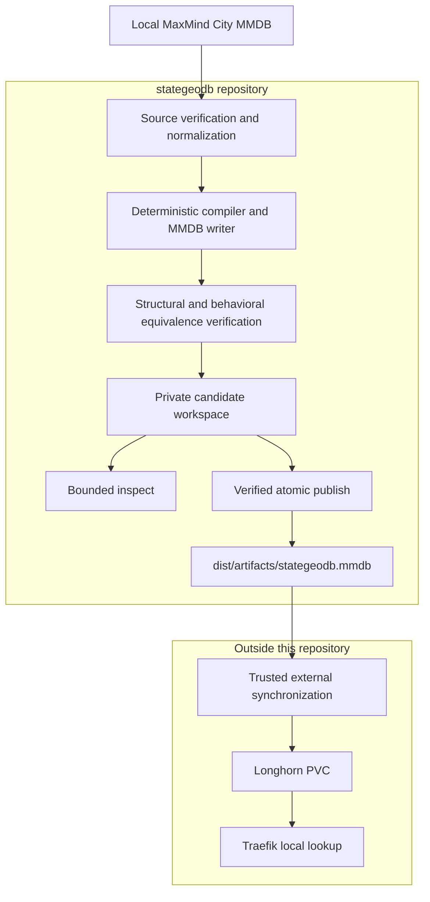

# Architecture

## Purpose and scope

`stategeodb` is an offline compiler for one locally available MaxMind City
MMDB. It produces the minimal runtime database consumed by
`traefik-plugin-state-geo`, while Traefik continues to perform local in-process
lookups.

The implemented v1 workflow is operated locally, currently from macOS or Linux
for publication. This repository owns source validation, normalization,
compilation, candidate verification, bounded inspection, and local atomic
publication. The Traefik plugin remains a separate repository and owns client
address selection, database lifecycle, and access-control policy.

Source acquisition, artifact transfer into a cluster, Longhorn behavior, and
Traefik deployment are outside this repository.

## Current system context



Comparison, merging, corrections, acquisition, reports, Kubernetes scheduling,
and rollback are not implemented parts of this flow.

## Implemented component boundaries

### `internal/source`

Owns provider-neutral `Record` values, prefix and location normalization,
logical source-ID validation, and deterministic record ordering. Records carry
geographic facts only.

### `internal/source/maxmind`

Owns the MaxMind reader lifetime. It opens and verifies supported City
databases, captures metadata without retaining caller paths, traverses the
default effective network view, decodes only country and first-subdivision
codes, and returns an all-or-nothing normalized record slice.

### `internal/mmdb`

Owns deterministic encoding of normalized records with the fixed runtime
schema and metadata constants. It sorts a copy of the input, rejects duplicate
prefixes and writer alias-region conflicts, and uses the pinned MaxMind writer.

### `internal/compiler`

Coordinates a single-source build. It validates the request, owns the private
workspace, closes the source before output creation, writes and syncs the
candidate, verifies its identity and structure, proves exact lookup
equivalence, and returns candidate ownership only on complete success.

### `internal/artifact`

Validates exact project metadata and the normalized country/subdivision fields
decoded from every traversed runtime record. It does not currently reject
unknown record fields. It is the reusable artifact-verification boundary used
during publication.

### `internal/inspect`

Requires exact project metadata, performs full structural verification, and
returns fixed metadata plus no more than 32 explicitly requested address
lookups. Matching metadata is a compatibility check, not proof of origin.

### `internal/publish`

Owns macOS/Linux local publication. It checks candidate and destination file
identities, copies and hashes an open candidate into a temporary sibling,
reverifies that temporary artifact, compares destination bytes, and commits by
rename under a trusted single-writer operating model.

### `internal/cli`

Parses command flags, maps domain errors to fixed redacted diagnostics, writes
machine-readable key/value results to stdout, and preserves the current binary
process-status contract. `cmd/stategeodb` supplies a signal-aware context and
calls this package. A failed stdout write can leave a partial result, so callers
must consume stdout only when process status is `0`.

## Source contract

The MaxMind adapter accepts only exact database types `GeoLite2-City` and
`GeoIP2-City`. It requires MMDB binary format 2.0, IP version 4 or 6, a positive
node count, record size 24, 28, or 32, valid UTF-8 metadata text, and at least
one description. Country, Enterprise, ASN, near-match, and project-generated
database types are unsupported source inputs.

Open succeeds only after metadata compatibility checks and the upstream full
structural verifier succeed. A successful database is pointer-owned and must be
closed. The reader is closed on failed open validation and by the compiler
immediately after record ingestion.

Each normalized record contains:

```go
type Record struct {
    Prefix      netip.Prefix
    Country     string
    Subdivision string
    SourceID    string
}
```

The record rules are:

- native IPv4 and IPv6 prefixes are masked to canonical network form;
- IPv4-mapped IPv6 prefixes wholly inside `::ffff:0:0/96` become native IPv4,
  with 96 removed from the prefix length;
- a shorter mapped prefix that also covers native IPv6 space is rejected;
- country is empty or exactly two ASCII letters, normalized to uppercase;
- first subdivision is empty or one to three ASCII letters or digits,
  normalized to uppercase;
- subdivision requires a country;
- an empty country and subdivision represent a present network with unknown
  required location;
- `SourceID` is a stable ASCII token supplied by the caller, not a path or URL;
- only `country.iso_code` and `subdivisions[0].iso_code` are decoded.

Records are returned in a total order: IPv4 before IPv6, then address, prefix
length, source ID, country, and subdivision. The default upstream `Networks()`
view suppresses synthetic IPv4 alias networks. Ingestion returns no partial
records on decoding failure or cancellation, and duplicate normalized prefixes
are rejected.

## Runtime artifact contract

Compiler-generated records contain only this data-bearing runtime shape:

```json
{
  "country": {
    "iso_code": "US"
  },
  "subdivisions": [
    {
      "iso_code": "CA"
    }
  ]
}
```

An unknown-location network is encoded as an empty map. It remains a
data-bearing prefix and is distinct from an address with no matching prefix.
Country is omitted when unknown; subdivisions are omitted when unknown.

Generated metadata and the logical schema identity are fixed as follows:

| Field | Contract |
| --- | --- |
| Database type | `StateGeo-Country-Subdivision` |
| Logical schema version reported by the CLI | `1` |
| Description | `stategeodb country/subdivision schema v1` |
| Build epoch | caller-supplied positive Unix timestamp |
| Binary format | `2.0` |
| IP version | `6` |
| Record size | `28` |
| Languages | empty |

Node count must be positive. The logical source ID is excluded from runtime
records and output bytes. Schema version is not a separate MMDB metadata key;
the exact description encodes the version and the CLI reports the corresponding
package constant. An incompatible runtime-record change requires a new database
type; a compatible revision retains the type and advances the logical version
and description together.

The current artifact verifier decodes and validates the required normalized
fields in every record but does not prove that unknown map fields or additional
subdivision elements are absent. Publication therefore assumes candidates come
from a trusted `stategeodb build` workflow.

## Build and equivalence lifecycle

1. Validate a non-nil context, source path, logical source ID, positive build
   epoch, and existing absolute non-symlink workspace root.
2. Bind the workspace-root identity through `os.Root`.
3. Open and structurally verify the source, ingest every normalized record,
   then close the source before creating a workspace.
4. Create a random workspace with mode `0700` and a new identity-checked
   `candidate.mmdb` with mode `0600`.
5. Sort and encode records deterministically, sync and close the candidate, and
   validate its size, type, mode, and identity.
6. Read the identity-bound candidate snapshot, reopen it through the reader,
   verify structure and exact metadata, and traverse every output network.
7. Convert source and output prefixes to inclusive effective-address
   intervals, reject overlaps, sort by address family and boundaries, and
   compare every covered segment for presence and location equality.
8. Revalidate the candidate and workspace-root identities, close the root, and
   return candidate ownership.

Interval comparison proves effective lookup equivalence, not identical prefix
shape. The writer may split or compact prefixes when every address still has
the same presence, country, and subdivision result.

Any compile error returns no candidate and attempts to remove the generated
workspace name inside the bound root. A successful candidate remains until its
owner explicitly calls `Cleanup`; the CLI retains it after successful output.
If writing successful CLI output fails, the CLI attempts candidate cleanup.
The workspace root must be operator-owned and exclusively writable during the
invocation: cleanup does not bind the child workspace-directory identity and is
not safe against a concurrent same-UID entry replacement.

Cancellation is checked before and between application-controlled stages and
inside source-record ingestion, artifact traversal, interval verification,
publication copy, and comparison loops. Individual upstream calls cannot be
interrupted mid-call. The complete MMDB writer window—sorting, insertion,
`WriteTo`, and candidate sync, stat, and close—runs until the next context check;
a second process signal does not force that window to terminate. Cancellation
observed before candidate return triggers workspace cleanup; it never changes
the stable published artifact.

## Inspection boundary

Inspection accepts artifacts whose metadata exactly matches the runtime
contract. It performs upstream full structural verification before producing a
result but cannot authenticate that a matching artifact was produced by this
compiler.

With no `--ip` flags, it returns metadata only. With addresses, it accepts at
most 32 explicit, zone-free addresses, unmaps mapped IPv4 addresses, and
returns results in request order. `found=false` means no data-bearing prefix;
`found=true` with empty country and subdivision means a present
unknown-location record.

Inspection does not traverse records to produce a dump. The only requested
record data comes from explicit address lookups. A domain failure produces no
formatted result; a later stdout write failure can leave partial bytes and
returns process status `1`.

## Publication boundary

Publication is implemented only for local macOS and Linux filesystems. Both
candidate and destination leaf paths must identify regular, non-symlink files;
an absent destination is allowed. Destination parent directories must already
exist. Candidate and parent directories, the publisher UID, and the temporary
namespace are trusted: callers must not mutate them concurrently, and
publication must be serialized per destination. The implementation has no
cross-process lock and does not support competing publishers or hostile
same-UID writers.

The publisher:

1. opens candidate and destination parents with `os.Root` and binds their
   identities;
2. opens a regular candidate and performs repeated identity checks;
3. creates a random temporary sibling with mode `0644`;
4. streams the candidate into that sibling while computing SHA-256;
5. syncs and closes the temporary file;
6. reopens the same temporary identity and verifies exact project metadata,
   structure, and normalized fields in every runtime record;
7. compares the temporary and destination byte streams exactly when the
   destination exists;
8. removes the temporary and returns `unchanged` when bytes match;
9. otherwise revalidates parent, destination, and temporary identities and
   renames the temporary file to the destination as the commit point.

Success reports `created`, `replaced`, or `unchanged`, along with size and
SHA-256. The candidate is never modified or deleted. No backup, version
history, or rollback artifact is created.

Cancellation observed before rename leaves the destination unchanged and
attempts name-scoped temporary cleanup. Cancellation observed only after a
successful rename does not turn the committed publication into failure. If the
CLI cannot write its result after publication returns, it exits with failure
but does not undo the commit; a retry detects `unchanged`.

File content is synced before rename. The implementation does not sync the
destination directory and therefore makes no directory-entry power-loss
durability claim.

## Determinism and correctness invariants

- Build epoch is explicit and positive; the compiler does not read wall time.
- Normalized record order is independent of input order and map iteration.
- Logical source ID does not affect output bytes.
- Exact duplicate normalized prefixes are rejected.
- Overlapping effective source or output intervals are rejected by equivalence
  verification.
- Native IPv6 records in the writer's IPv4 storage region are rejected, and
  alias-region insertion failures are build failures.
- Generated metadata and normalized fields in every runtime record are verified
  before publication; absence of unknown fields is not currently enforced.
- Equivalence covers the complete effective IPv4 and IPv6 address intervals
  represented by source and output, including present unknown locations.
- Compile returns a fully verified candidate or no candidate.

Tests cover repeated and cross-process deterministic writer output, shuffled
input, changed source IDs, both address families, split and compacted prefixes,
unknown-location presence, cancellation boundaries, identity replacement, and
pre-commit publication failures.

## Filesystem and trust boundaries

Compiler workspaces are private (`0700`) and candidate files are private
(`0600`). Workspace creation, candidate access, and cleanup are confined by an
identity-bound `os.Root`. Cleanup receives the generated workspace name and
does not infer a recursive target from output text or an unresolved glob. It is
root/name-scoped, not identity-bound at the child workspace entry, so exclusive
control of the workspace root is required.

Publication checks identities and independently reverifies the temporary file
it creates. Candidate and destination leaf symlinks, directories, and special
files are rejected. The identity checks do not make an owner-writable file
immutable between check and rename, and the current cleanup and rename actions
are pathname operations. Trusted parents, no concurrent same-UID mutation, and
a single publisher per destination are therefore part of the operating model.

Caller paths and upstream parser details are omitted from normal domain errors
and fixed CLI diagnostics. Successful `candidate_path` output is informational:
trust-sensitive consumers must open and reverify the file under their own
exclusive-control or immutable-snapshot mechanism. The current publisher uses
the exclusive-control model documented above.

Generated CLI and artifact output belongs under ignored `dist/`. Private source
data and workspaces belong under ignored `tmp/` or another operator-owned local
path.

## Performance and resource model

The repository includes the approved 250-record upstream fixture, deterministic
synthetic compilation benchmarks up to 100,000 records, and an opt-in real City
test and benchmark.

The reported real GeoLite measurement used approximately 5.8 million normalized
records. Warm-cache full-compilation benchmark samples took roughly 19–21
seconds on the tested Apple Silicon machine. Process/container measurements
reported approximately 2.7 GiB peak resident memory on that host and in the
tested Linux container. In the measured container configuration, this dataset
did not complete with 512 MiB or 1 GiB limits. These are observations from
particular data, hardware, runtime, cache state, and measurement conditions; the
private source was not available for this documentation task and the results
are not performance guarantees.

Go benchmark `B/op` reports cumulative allocations per operation, not peak
resident memory. Peak RSS must be measured at the process or container level.
The supported v1 build workflow is local Mac/Linux operation. Approximately 4
GiB available memory is the current operational-headroom recommendation, not a
measured minimum. Kubernetes build automation and memory optimization are
deferred to the [roadmap](ROADMAP.md).

## Deployment boundary

The default stable local artifact is:

```text
dist/artifacts/stategeodb.mmdb
```

Created or replaced files have mode `0644`; an `unchanged` publication preserves
the existing file identity and mode. Any transfer to a Longhorn PVC is a
separate trusted workflow outside this repository. Such an integration needs to
account for directory traversal permissions, Traefik's runtime UID, cross-UID
file readability, volume topology, and reload verification.

`stategeodb` currently has no Kubernetes API use, manifest, PVC synchronization,
cluster deployment, Traefik reload, backup, or rollback responsibility.

## Failure model

| Condition | Candidate or destination effect |
| --- | --- |
| Invalid build or publish request | No generated candidate and no destination change |
| Unsupported or corrupt source | No candidate workspace is created |
| Cancelled build | No candidate is returned; root/name-scoped workspace cleanup is attempted |
| Candidate write or verification failure | No candidate is returned; root/name-scoped workspace cleanup is attempted |
| Equivalence mismatch | No candidate is returned; root/name-scoped workspace cleanup is attempted |
| Inspect domain failure | No formatted result is produced; inspected file is unchanged |
| Unchanged publish | Success; destination identity and metadata remain unchanged; candidate retained |
| Pre-commit publish failure | Destination remains unchanged; temporary cleanup is attempted; candidate retained |
| Rename failure | Destination remains at its pre-commit state; temporary cleanup is attempted |
| Post-commit publisher cleanup failure | Destination remains committed; CLI returns status 1 without result output; retry normally reports `unchanged` |
| Post-commit CLI output failure | Destination remains committed; CLI returns status 1; retry reports `unchanged` |

Cleanup failures are joined to the primary internal classification without
exposing raw filesystem details. The current CLI uses status `0` for success
and `1` for all failures; fixed stderr diagnostics distinguish the domain. Any
command output-write failure may leave partial stdout, which must be discarded.

## Security and licensing

Licensed production sources, generated production artifacts, account IDs,
license keys, authenticated URLs, and `GeoIP.conf` stay out of Git. Approved
fixture origins, licenses, notices, and checksums are recorded in
[testdata/README.md](../testdata/README.md).

Bounded inspection avoids bulk licensed-data output. Normal diagnostics redact
paths, input values, parser offsets, and file contents. Compiler and publisher
filesystem operations use scoped roots, identity checks, regular-file checks,
private workspaces, and name-scoped cleanup. These controls assume trusted,
exclusively controlled working and destination parents; they do not protect
against concurrent hostile same-UID mutation.

Operators are responsible for obtaining sources lawfully, keeping them current,
meeting attribution requirements, and reviewing any redistribution. A generated
or minimized artifact is still derived from the licensed source; redistribution
is not automatically permitted.

## Current non-goals

- A request-time API or remote lookup dependency.
- Network, SQL, document-database, or cache service in Traefik's request path.
- Access-control allow/deny policy inside MMDB records.
- Source downloading or credential management.
- Kubernetes deployment or automatic PVC synchronization.
- Custom location corrections.
- Multi-source comparison, merging, or voting.
- Backup, retained generations, or rollback.
- Treating memory optimization as a blocker for the current local v1.

## Future direction

Durable future priorities are recorded in [ROADMAP.md](ROADMAP.md). Current
operator behavior remains documented in the repository [README](../README.md).
